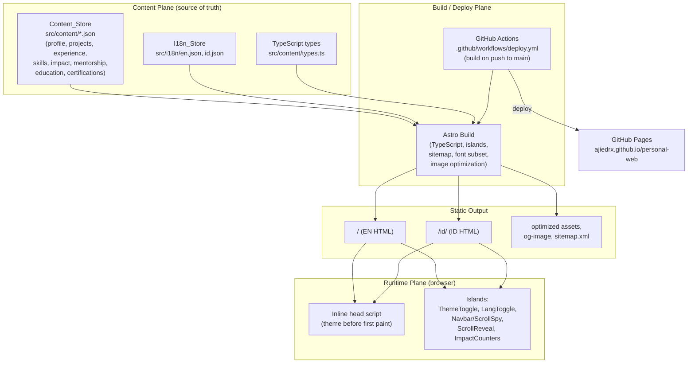

# Design Document

## Overview

This document describes the technical design for the personal portfolio website of Ajie Dibyo R. (@ajiedrx), a single-page, bilingual (English default, Indonesian secondary), statically generated site built with **Astro + TypeScript** and deployed to **GitHub Pages** via **GitHub Actions**. The design realizes all 22 requirements in `requirements.md` and follows the approved blueprint in `PORTFOLIO-OUTLINE.md`.

The site is a "sales pitch" version of the owner's resume. It presents nine ordered sections on one page, with anchor navigation, smooth scroll, scroll-spy, a persisted theme toggle (dark default) with a ripple transition, a persisted language toggle, scroll-reveal animations, and animated impact counters. All content is separated from markup into typed data files (`src/content/`) and localized string files (`src/i18n/`).

### Design Goals and Guiding Principles

- **Static-first, JS-minimal.** Everything renders to static HTML at build time. JavaScript ships only for the few interactive "islands" (Req 1.4, 19.4).
- **Content/markup separation.** Structured data lives in `Content_Store`; localized UI strings live in `I18n_Store`. Updating a value requires no markup change (Req 1.3, 22.5).
- **Accessible by construction.** Semantic HTML, visible focus, keyboard operability, WCAG AA contrast, and `prefers-reduced-motion` respect are built into the token system and component contracts (Req 18).
- **Editorial/brutalist-refined + subtle kinetic** visual direction (Option A + touch of B), driven by CSS custom-property design tokens (blueprint §6, §10).
- **Progressive enhancement.** Theme, ripple transition, and animations degrade gracefully when APIs are unavailable or motion is reduced (Req 7.4, 7.6, 7.9, 17.2).

### Key Design Decisions (traceability summary)

| Decision | Rationale | Requirements |
|---|---|---|
| Astro static output + islands | Fast, SEO-friendly, minimal JS on GitHub Pages | 1.1, 1.4, 19.4 |
| `site` + `base` configured for project pages | Correct asset/anchor paths under `/personal-web/` | 1.5 |
| Astro i18n routing `/` (EN) + `/id/` (ID) | SEO-friendly per-locale URLs | 5.1, 5.2 |
| Locale helper with EN fallback | No missing-string breakage | 5.6 |
| Inline head theme script | Apply theme before first paint, no FOUC | 7.7, 7.8 |
| View Transitions ripple + clip-path fallback | "Wow" transition with graceful degradation | 7.3, 7.4 |
| Typed content model + validation-on-render | Data integrity and safe omission of invalid records | 12.4, 22.1, 22.2 |
| Featured-only certification filter | Show only most relevant credentials | 14.4, 14.7 |

## Architecture

### High-Level Architecture

The system has three planes: a **build/deploy plane** (Astro + GitHub Actions), a **content plane** (typed data + localized strings), and a **runtime plane** (static HTML with a handful of hydrated islands running in the browser).



### Astro Configuration

`astro.config.mjs` configures the site for GitHub Pages project hosting and i18n routing (Req 1.1, 1.5, 5.1, 5.2, 20.3):

```js
import { defineConfig } from 'astro/config';
import sitemap from '@astrojs/sitemap';

export default defineConfig({
  site: 'https://ajiedrx.github.io',
  base: '/personal-web',
  output: 'static',
  trailingSlash: 'ignore',
  i18n: {
    defaultLocale: 'en',
    locales: ['en', 'id'],
    routing: { prefixDefaultLocale: false }, // EN at '/', ID at '/id/'
  },
  integrations: [sitemap()],
  // image optimization + font subsetting handled via build config / assets
});
```

- `base: '/personal-web'` ensures internal links, anchors, and asset URLs resolve correctly under the project subpath. A `withBase()` helper wraps all internal hrefs so anchors and locale routes are correct in both local and Pages environments (Req 1.5).
- `prefixDefaultLocale: false` serves EN at `/` and ID at `/id/` (Req 5.1, 5.2).
- `@astrojs/sitemap` generates `sitemap.xml` at build (Req 20.3).

### Rendering Model and Island Hydration Strategy

Astro renders all components to static HTML by default (zero JS). Only components that require browser interactivity are declared as islands with an explicit hydration directive (Req 1.4, 19.4):

| Island | Hydration directive | Why | Requirements |
|---|---|---|---|
| `ThemeToggle` | `client:load` | Must respond to first interaction; coordinates with inline head script | 7.1–7.9 |
| `LanguageToggle` | `client:load` | Must persist preference and route on interaction | 6.1–6.4 |
| `Navbar` (scroll-spy + reveal) | `client:idle` | Non-critical; can hydrate after load | 4.3, 4.4 |
| `ScrollReveal` controller | `client:visible` | Only needed once sections approach viewport | 17.1 |
| `ImpactCounters` | `client:visible` | Animate only when Impact section nears viewport | 13.2 |

Everything else — Hero copy, About, Expertise, Experience, Project cards markup, Contact, Footer — is fully static HTML. The theme's pre-paint application is handled by a tiny inline script in `<head>` (not an island) so it runs before hydration and before first paint (Req 7.7, 7.8).

### Deployment Pipeline (GitHub Actions → GitHub Pages)

`.github/workflows/deploy.yml` builds and publishes the site on every push to `main`. It uses the official Pages actions so build runs before publish and a failed build never reaches the deploy step (Req 2.1, 2.2, 2.3).

```yaml
name: Deploy to GitHub Pages
on:
  push:
    branches: [main]          # build on push to main (Req 2.1)
  workflow_dispatch:
permissions:
  contents: read
  pages: write
  id-token: write
concurrency:
  group: pages
  cancel-in-progress: true
jobs:
  build:                       # (Req 2.1)
    runs-on: ubuntu-latest
    steps:
      - uses: actions/checkout@v4
      - uses: actions/setup-node@v4
        with: { node-version: 20, cache: npm }
      - run: npm ci
      - run: npm test -- --run # tests gate the build (Req 2.3)
      - run: npm run build     # astro build; non-zero exit stops the job (Req 2.3)
      - uses: actions/configure-pages@v5
      - uses: actions/upload-pages-artifact@v3
        with: { path: dist }
  deploy:                      # only runs if build job succeeds (Req 2.2, 2.3)
    needs: build
    runs-on: ubuntu-latest
    environment:
      name: github-pages
      url: ${{ steps.deployment.outputs.page_url }}
    steps:
      - id: deployment
        uses: actions/deploy-pages@v4
```

The `deploy` job declares `needs: build`, so a failed build (compile error or failing test) stops the pipeline before publishing and the previously published site stays live (Req 2.3). On success, the built `dist/` artifact is published to GitHub Pages under `ajiedrx.github.io/personal-web` (Req 2.2), matching the `site`/`base` configuration above.

### Directory / Project Structure

```
personal-web/
├── astro.config.mjs
├── tsconfig.json
├── package.json
├── public/
│   ├── favicon.svg
│   ├── og-image.png                 # Open Graph preview (Req 20.2)
│   └── robots.txt
├── .github/
│   └── workflows/
│       └── deploy.yml               # build + deploy to Pages (Req 2)
└── src/
    ├── pages/
    │   ├── index.astro              # EN page '/' (Req 5.1)
    │   └── id/
    │       └── index.astro          # ID page '/id/' (Req 5.2)
    ├── layouts/
    │   └── BaseLayout.astro         # <head>, meta/OG/JSON-LD, theme init script
    ├── components/                  # reusable UI + islands
    │   ├── Navbar.astro / Navbar.ts # anchor nav, scroll-spy, sticky/reveal
    │   ├── ThemeToggle.astro        # island: ripple theme switch
    │   ├── LanguageToggle.astro     # island: locale switch + persist
    │   ├── ProjectCard.astro        # single Project_Card
    │   ├── ImpactCounter.astro      # island wrapper for counters
    │   ├── ScrollReveal.astro       # IntersectionObserver reveal controller
    │   ├── SkillGroup.astro
    │   ├── TimelineEntry.astro
    │   └── SectionHeading.astro
    ├── sections/                    # the nine ordered sections
    │   ├── Hero.astro
    │   ├── About.astro
    │   ├── Expertise.astro
    │   ├── Experience.astro
    │   ├── FeaturedProjects.astro
    │   ├── Impact.astro
    │   ├── MentorshipEducation.astro
    │   ├── Contact.astro
    │   └── Footer.astro
    ├── content/                     # Content_Store (Req 22.1)
    │   ├── types.ts                 # TypeScript data model interfaces
    │   ├── profile.json             # name, role, location, availability, contact
    │   ├── projects.json            # curated projects
    │   ├── experience.json          # career timeline
    │   ├── skills.json              # skill groups
    │   ├── impact.json              # impact highlight values
    │   ├── mentorship.json          # mentorship entries
    │   ├── education.json           # education entries
    │   └── certifications.json      # Certification_Entry records
    ├── i18n/                        # I18n_Store (Req 22.3)
    │   ├── en.json                  # English UI strings + localized content
    │   ├── id.json                  # Indonesian UI strings + localized content
    │   └── locale.ts                # locale helper: t(), getLocale(), fallback
    ├── lib/
    │   ├── withBase.ts              # prefix internal hrefs with base path
    │   ├── content.ts               # load + validate content, filter helpers
    │   └── seo.ts                   # meta/OG/JSON-LD builders
    └── styles/
        ├── tokens.css               # design tokens: color, spacing, type
        ├── themes.css               # light + dark theme token values
        ├── global.css               # base/reset, semantic element styles
        └── motion.css               # reveal/ripple; reduced-motion guards
```

### Component and Section Inventory

**Layout / infrastructure**

- **BaseLayout.astro** — Wraps every page. Emits `<html lang>` per locale (Req 5.4), `<head>` metadata (title, description, OG, JSON-LD Person — Req 20.1, 20.2, 20.4), the inline pre-paint theme script (Req 7.7, 7.8), and the sticky Navbar. Renders one `<main>` landmark and one `<h1>` (Req 18.1).

**Sections (rendered in fixed order — Req 3.2)**

1. **Hero.astro** — Owner name + role "Full-Stack Mobile Engineer", tagline from I18n_Store, dual CTAs to `#projects` and `#contact`, subtle kinetic visual (disabled under reduced motion) (Req 8).
2. **About.astro** — Positioning narrative (I18n), location "Surabaya, Indonesia", availability from Content_Store (Req 9).
3. **Expertise.astro** — Four `SkillGroup`s: Core Mobile, Full-Stack, Modern Tech, Quality (Req 10).
4. **Experience.astro** — Chronological `TimelineEntry` list, newest first (Req 11).
5. **FeaturedProjects.astro** — One `ProjectCard` per valid curated project; invalid records omitted (Req 12).
6. **Impact.astro** — `ImpactCounter` islands with labels/units (Req 13).
7. **MentorshipEducation.astro** — Mentorship + education entries + featured certifications only (Req 14).
8. **Contact.astro** — Email/LinkedIn/GitHub/social + mailto CTA; placeholder-safe (Req 15).
9. **Footer.astro** — Copyright with owner name + quick links (Req 16).

**Interactive components (islands)**

- **Navbar** — Anchor links to each section, sticky/reveal behavior, scroll-spy active-link highlight, hosts Theme and Language toggles, mobile navigation affordance (Req 4, 21.3).
- **ThemeToggle** — Dark/light switch with ripple transition + fallback + persistence (Req 7).
- **LanguageToggle** — EN/ID switch, persists preference, routes to locale (Req 6).
- **ScrollReveal** — IntersectionObserver-driven reveal; no-op under reduced motion (Req 17).
- **ImpactCounter** — Count-up on viewport entry; final value immediately under reduced motion (Req 13.2, 13.3).

## Components and Interfaces

### Locale Helper (`src/i18n/locale.ts`)

Provides typed string lookup with English fallback (Req 5.3, 5.6).

```ts
export type Locale = 'en' | 'id';

import en from './en.json';
import id from './id.json';

const dictionaries: Record<Locale, Record<string, unknown>> = { en, id };

/** Resolve a dotted key for a locale, falling back to English when missing. */
export function t(locale: Locale, key: string): string {
  const fromLocale = resolveKey(dictionaries[locale], key);
  if (fromLocale !== undefined) return String(fromLocale);
  const fromEn = resolveKey(dictionaries.en, key);   // fallback (Req 5.6)
  return fromEn !== undefined ? String(fromEn) : key; // last resort: echo key
}

/** All dotted leaf keys present in a dictionary (used for parity checks). */
export function keysOf(dict: Record<string, unknown>): string[] { /* ... */ }

function resolveKey(dict: Record<string, unknown>, key: string): unknown { /* dotted lookup */ }

export const dictionaryFor = (locale: Locale) => dictionaries[locale];
```

The same nine sections render in the same order for both locales; the page components are locale-parameterized and pull every visible string through `t()` (Req 5.5).

### Base Path Helper (`src/lib/withBase.ts`)

```ts
// Ensures internal links/anchors/assets resolve under base '/personal-web' (Req 1.5, 4.2)
export function withBase(path: string): string { /* join import.meta.env.BASE_URL + path */ }
export function localePath(locale: Locale, hash = ''): string {
  // '/' for en, '/id/' for id, both base-prefixed; optional #anchor (Req 6.2)
}
```

### Content Loader and Validators (`src/lib/content.ts`)

Loads JSON content, validates against the typed model, and exposes filtered views. Validation drives the "omit invalid record, keep the rest" behavior for projects (Req 12.4) and the featured-only filter for certifications (Req 14.4).

```ts
import type { Project, CertificationEntry } from '../content/types';

/** True only when all required Project_Card fields are present and well-formed (Req 12.3, 12.4). */
export function isValidProject(p: Partial<Project>): p is Project { /* ... */ }

/** Keep only valid projects, preserving source order (Req 12.1, 12.4). */
export function validProjects(all: Partial<Project>[]): Project[] {
  return all.filter(isValidProject);
}

/** Featured certifications only, regardless of active/expired status (Req 14.4, 14.7). */
export function featuredCertifications(all: CertificationEntry[]): CertificationEntry[] {
  return all.filter((c) => c.featured === true);
}

/** Timeline sorted most-recent-first (Req 11.3). */
export function sortExperienceDesc(entries: ExperienceEntry[]): ExperienceEntry[] { /* ... */ }
```

### Navbar / Scroll-Spy Interface

```ts
interface NavLink { id: string; labelKey: string; }   // one per navigable section (Req 4.1)

// Behavior contract:
// - clicking a link scrolls smoothly to `#id`, or jumps instantly under reduced motion (Req 4.2, 4.5)
// - IntersectionObserver marks the in-view section's link active (Req 4.3)
// - navbar stays reachable via sticky/reveal on scroll (Req 4.4)
```

### Theme Toggle Interface

```ts
type Theme = 'dark' | 'light';

// applyTheme(theme): set data-theme attribute on <html> and update toggle state (Req 7.1)
// toggleTheme(originX, originY): switch theme with ripple/reveal from click point (Req 7.2–7.4, 7.9)
// persistTheme(theme): write to localStorage; on failure, apply for session only (Req 7.5, 7.6)
// readStoredTheme(): 'dark' | 'light' | null
```

The inline head script (in `BaseLayout`) reads `localStorage` (or defaults to `dark`) and sets `data-theme` on `<html>` synchronously before first paint (Req 7.7, 7.8).

### Impact Counter Interface

```ts
interface ImpactItem { value: number; suffix?: string; label: string; } // (Req 13.1, 13.4)
// animateTo(final): count up when in viewport (Req 13.2)
// under reduced motion, render `final` immediately (Req 13.3)
```

## Data Models

All content is typed in `src/content/types.ts`. Content JSON files conform to these interfaces; the loader validates them (Req 22.1, 22.2).

```ts
// ---- Profile / contact / availability (Req 9, 15, 22.4) ----
export interface Profile {
  name: string;                 // owner name (Req 8.1, 16.1)
  role: string;                 // "Full-Stack Mobile Engineer"
  location: string;             // "Surabaya, Indonesia" (Req 9.2)
  availability: string;         // availability status (Req 9.3, 22.4)
  contact: ContactInfo;
}

export interface ContactInfo {
  email: string;                // may be placeholder (Req 15.4, 22.4)
  linkedin: string;             // URL, may be placeholder (Req 22.4)
  github: string;               // "https://github.com/ajiedrx" (Req 15.2)
  socials?: SocialLink[];       // optional additional socials (Req 15.1, 22.4)
}
export interface SocialLink { label: string; url: string; isPlaceholder?: boolean; }

// ---- Skills (Req 10) ----
export type SkillCategory = 'core-mobile' | 'full-stack' | 'modern-tech' | 'quality';
export interface SkillGroup {
  category: SkillCategory;      // one of the four fixed categories (Req 10.1)
  labelKey: string;             // localized category label
  skills: string[];             // entries shown within the group (Req 10.2, 10.3)
}

// ---- Experience timeline (Req 11) ----
export interface ExperienceEntry {
  role: string;
  organization: string;
  startDate: string;            // ISO 'YYYY-MM' for sorting (Req 11.3)
  endDate: string | null;       // null => "Present"
  highlights: string[];         // localized via keys where applicable (Req 11.2)
}

// ---- Featured projects (Req 12) ----
export interface Project {
  title: string;                // required (Req 12.3, 12.4)
  description: string;          // "selling" description; required (Req 12.3, 12.4)
  techStack: string[];          // 1..10 chips; required (Req 12.3, 12.4)
  repoUrl: string;              // required (Req 12.3, 12.4)
  demoUrl?: string;             // optional (Req 12.7)
  screenshot?: string;          // optional asset path (Req 12.8)
}

// ---- Impact highlights (Req 13) ----
export interface ImpactItem {
  value: number;                // final numeric value (Req 13.2)
  suffix?: string;              // '%', '+', etc.
  labelKey: string;             // localized unit/label (Req 13.4)
}

// ---- Mentorship & education (Req 14) ----
export interface MentorshipEntry { title: string; organization: string; date: string; } // (Req 14.1, 14.3)
export interface EducationEntry  { title: string; organization: string; year: string; }  // (Req 14.2, 14.3)

// ---- Certification (Req 14.4–14.7, 22.2) ----
export type CertStatus = 'active' | 'expired';
export interface CertificationEntry {
  title: string;                // (Req 14.5)
  issuer: string;               // issuing organization (Req 14.5)
  issuedDate: string;           // ISO 'YYYY-MM' or 'YYYY'; year shown by default (Req 14.5)
  expiryDate?: string;          // optional; hidden unless explicitly enabled (Req 14.6)
  credentialId?: string;        // optional; hidden unless explicitly enabled (Req 14.6)
  skills?: string[];            // optional associated skills (Req 22.2)
  featured: boolean;            // only featured render (Req 14.4)
  status: CertStatus;           // active | expired; both render if featured (Req 14.7)
  showDetails?: boolean;        // Content_Store opt-in to show expiry/credentialId (Req 14.6)
}
```

**Content/i18n file organization.** `src/content/*.json` holds structured, language-neutral data (dates, URLs, numeric values, flags). Human-readable copy that differs per language (taglines, positioning narrative, descriptions, labels, category names, availability text) is stored as keys resolved through `src/i18n/en.json` and `id.json`. Both dictionaries share an identical key set; ID falls back to EN when a key is missing (Req 5.3, 5.5, 5.6, 22.3). Placeholder contact fields (`email`, `linkedin`, socials) live in `profile.json` and render as inert, non-broken targets when flagged as placeholders (Req 15.4, 22.4). Any value change in these files is reflected in output on the next build with no markup edits (Req 22.5).

## Correctness Properties

*A property is a characteristic or behavior that should hold true across all valid executions of a system — essentially, a formal statement about what the system should do. Properties serve as the bridge between human-readable specifications and machine-verifiable correctness guarantees.*

Property-based testing applies to this feature's **pure logic layer**: the locale helper (key parity + fallback), preference round-trips, and the content filtering/sorting functions (`validProjects`, `featuredCertifications`, `sortExperienceDesc`, certification detail visibility, impact display value). It does **not** apply to static markup rendering, the deployment pipeline (integration), or visual/DOM interaction behavior — those are covered by example, integration, and structural tests in the Testing Strategy below.

The following properties survive property reflection (redundant candidates merged: featured + status-independence combined into Property 5; project required-fields + chip-count bound combined into Property 4).

### Property 1: i18n key parity between locales

*For all* leaf keys in either the English or the Indonesian dictionary, the key set of `en.json` equals the key set of `id.json` (every key present in one locale is present in the other).

**Validates: Requirements 5.5**

### Property 2: English fallback for missing keys

*For any* locale and any key: if the key resolves in that locale's dictionary, `t(locale, key)` returns the locale value; if the key is absent from that locale but present in English, `t(locale, key)` returns the English value.

**Validates: Requirements 5.3, 5.6**

### Property 3: Theme preference round-trip

*For any* theme in `{dark, light}`, calling `persistTheme(theme)` and then `readStoredTheme()` returns the same theme.

**Validates: Requirements 7.5, 7.7**

### Property 4: Valid-project filtering preserves order and validity

*For any* list of (possibly malformed) project records, `validProjects(list)` returns exactly those records that have a non-empty title, a non-empty selling description, a repository link, and between 1 and 10 tech-stack chips; it drops all others and preserves the source order of the kept records.

**Validates: Requirements 12.1, 12.3, 12.4**

### Property 5: Featured-only certification filtering, independent of status

*For any* list of certification records with arbitrary `active`/`expired` statuses, `featuredCertifications(list)` returns exactly the records whose `featured` flag is set — including every featured record regardless of status and excluding every non-featured record.

**Validates: Requirements 14.4, 14.7**

### Property 6: Certification detail fields hidden unless enabled

*For any* certification record, the set of visible detail fields excludes `expiryDate` and `credentialId` when `showDetails` is not enabled; when `showDetails` is enabled, present `expiryDate` and `credentialId` values are included.

**Validates: Requirements 14.6**

### Property 7: Experience timeline is sorted most-recent-first and lossless

*For any* list of experience entries, `sortExperienceDesc(list)` returns a permutation of the input (same multiset of entries) ordered so that start dates are non-increasing, with an open-ended (`endDate === null`, "Present") entry ordered no earlier than any entry it precedes by start date.

**Validates: Requirements 11.1, 11.3**

### Property 8: Impact counter final value under reduced motion

*For any* impact item, resolving its display value with reduced motion enabled returns exactly the item's final `value`.

**Validates: Requirements 13.3**

### Property 9: Language preference round-trip

*For any* language in `{en, id}`, calling `persistLanguage(lang)` and then `readStoredLanguage()` returns the same language.

**Validates: Requirements 6.3, 6.4**

### Property 10: Theme selection survives storage failure

*For any* theme in `{dark, light}`, when the storage backend throws on write, applying the theme does not raise an error and the resulting active theme equals the selected theme.

**Validates: Requirements 7.6**

## Error Handling

The site is static and read-mostly, so error handling focuses on **content integrity at build time** and **graceful runtime degradation**.

### Missing or malformed content fields (Req 12.4, 15.4, 22.1)

- **Projects:** `isValidProject` rejects any record missing a required field (title, selling description, repository link) or with a tech-stack chip count outside 1–10. `validProjects` filters these out and continues rendering the remaining valid cards; no partial or broken card is emitted (Property 4, Req 12.4).
- **Placeholder contact values:** contact entries flagged as placeholders render as inert text (no `href`, or a disabled visual state) so there is never a broken link target; the mailto CTA is only wired when a real email is present (Req 15.4).
- **Build-time validation logging:** the content loader logs a warning listing any omitted/invalid records so the owner sees which data needs fixing, without failing the build.

### Missing i18n keys (Req 5.6)

- `t()` resolves in-locale first, then falls back to the English value, and as a last resort echoes the key so a missing translation never renders as blank or throws (Property 2). Key parity between locales is additionally guarded by a test (Property 1) to catch drift early.

### localStorage failures (Req 7.6)

- All storage reads/writes for theme and language are wrapped in try/catch. A write failure (private mode, quota, disabled storage) is swallowed; the selected theme/language is still applied for the current session (Property 10). Reads that throw are treated as "no stored preference," so the dark default applies (Req 7.8).

### Unsupported View Transitions API (Req 7.4)

- `ThemeToggle` feature-detects `document.startViewTransition`. When present, the theme change is wrapped in a view transition and animated as a ripple from the click point (Req 7.3). When absent, it falls back to a `clip-path` circle-reveal animation from the same click point (Req 7.4). Both paths complete within 200–600 ms and the overall switch within 600 ms (Req 7.2).

### Reduced motion (Req 4.5, 7.9, 8.5, 13.3, 17.2)

- A single `prefers-reduced-motion` check gates every animation path: anchor navigation uses instant scroll, theme switch applies without ripple/reveal, the hero kinetic element renders static, impact counters show final values immediately, and scroll-reveal renders sections in their final state. `motion.css` also wraps decorative transitions in a `@media (prefers-reduced-motion: reduce)` guard as defense in depth (Req 18.7).

### Deployment failures (Req 2.3)

- The GitHub Actions workflow runs build before deploy. A non-zero build exit stops the job before the deploy step, and the failed run is reported in the Actions UI; the previously published site remains live.

## Testing Strategy

The strategy combines **property-based tests** for pure logic, **example/unit tests** for specific behaviors and edge cases, **structural/accessibility tests** on rendered output, and **integration tests** for the deployment pipeline.

### Tooling

- **Test runner:** Vitest (integrates cleanly with the Astro/Vite toolchain, TypeScript-native).
- **Property-based testing library:** **fast-check** (the standard choice for TypeScript). Property tests are not hand-rolled; fast-check generates inputs.
- **DOM/structure assertions:** render components/pages and assert against the produced HTML (e.g., Astro container rendering or built output parsing).
- **CI:** tests run in the GitHub Actions workflow; test failures fail the build before deploy (Req 2.3).

> All example/watch-mode runs use a single-execution flag (e.g., `vitest --run`) rather than watch mode.

### Property-Based Tests (fast-check)

- Each Correctness Property (1–10) is implemented as a **single** property-based test.
- Each test runs a **minimum of 100 iterations**.
- Each test is tagged with a comment in the format:
  `// Feature: personal-portfolio-web, Property {number}: {property_text}`
- Generators:
  - Locale dictionaries with randomized keys/holes for Properties 1–2.
  - `{dark, light}` / `{en, id}` enumerations for Properties 3, 9.
  - Arbitrary project records (valid + malformed, random chip counts including 0 and >10) for Property 4.
  - Certification lists with random `featured` flags and random `active`/`expired` status for Properties 5–6.
  - Experience lists with random start/end dates (including `null` end) for Property 7.
  - Arbitrary impact items for Property 8.
  - A throwing storage stub for Property 10.

### Unit / Example Tests

Focused on specific examples, edge cases, and behaviors not suited to universal quantification:

- Dark theme is the default when no preference is stored (Req 7.8).
- Section render order matches the fixed nine-section sequence (Req 3.2), and each navigable section has a unique anchor id (Req 3.3, 4.1).
- Anchor navigation uses `smooth` normally and `auto` (instant) under reduced motion (Req 4.2, 4.5).
- Hero renders name, role, tagline, and both CTAs targeting `#projects` and `#contact` (Req 8).
- Curated project set includes Todo KMP, InstaApp, GAMV, LagiDimana, Movapp (Req 12.2).
- Project card shows demo link / screenshot only when provided (Req 12.7, 12.8), and hover state differs from default (Req 12.5).
- Contact section renders the verified GitHub link and a working mailto CTA; placeholder values render without broken targets (Req 15.2–15.4).
- Featured certification shows title, issuer, issued year; expiry/credentialId hidden by default (Req 14.5, 14.6).

### Structural & Accessibility Tests

- Exactly one `<h1>` per page and no skipped heading levels (Req 18.1).
- Semantic landmarks (`nav`, `main`, `footer`) present (Req 18.1).
- Interactive elements are keyboard operable (Tab order, Enter/Space activation) and expose visible focus (Req 18.4, 18.5).
- Enumerate defined foreground/background token pairs for both themes and assert computed contrast ≥ 4.5:1 (normal text) / ≥ 3:1 (large text and focus indicator) (Req 18.4, 18.6).
- Automated a11y scan (e.g., axe) on both locale pages as a smoke check. *Note: full WCAG AA conformance also requires manual testing with assistive technologies and expert review; automated checks are necessary but not sufficient.*

### SEO / Output Tests

- `<title>` and meta description present per locale (Req 20.1).
- Open Graph tags present (Req 20.2).
- `sitemap.xml` generated at build (Req 20.3).
- Valid Person JSON-LD present describing the owner (Req 20.4).
- `<html lang>` equals `en` on `/` and `id` on `/id/` (Req 5.4).
- No client JavaScript emitted for static sections; only designated islands hydrate (Req 1.4, 19.4).

### Integration Tests

- The GitHub Actions workflow builds on push to `main`, publishes on success, and stops before publishing on build failure (Req 2). Validated via a representative CI run rather than repeated iterations, since behavior does not vary with input.
- Built output is served under the `/personal-web/` base with correct asset and anchor paths (Req 1.5).

### Responsive / Performance Checks

- Layout adapts across defined breakpoints (mobile-first), navbar remains accessible on small viewports (Req 21).
- Below-the-fold images use lazy loading and optimized assets; fonts are subset at build (Req 19.1–19.3). Spot-checked via a Lighthouse run in CI or locally.
